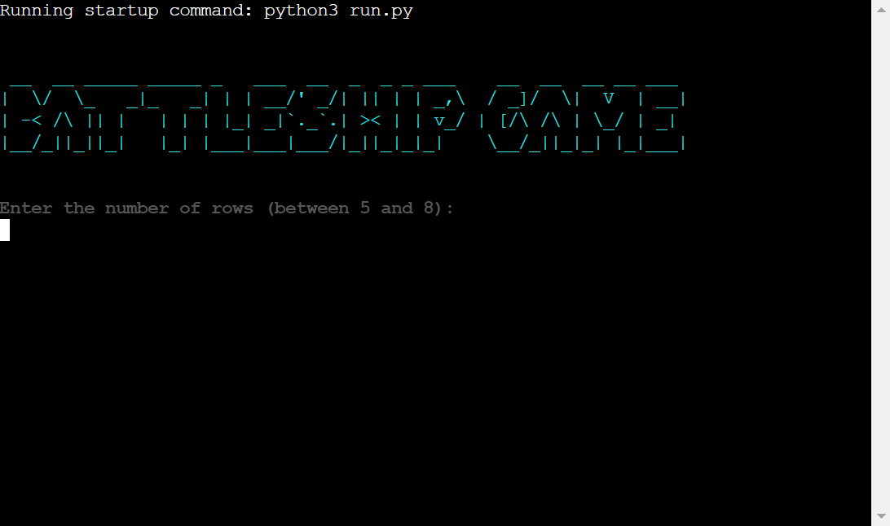

# Battleship Game

**Battleship Game is a Python terminal game which runs on Heroku. Users are supposed to beat the computer by sinking all of the computer's battleships before computer sinks theirs. Each battleship occupies one field on the grid(board).**

***[Live version](https://dcigic92-pp3-battleship-game-e0f029a41560.herokuapp.com/)*** created by **Dino Cigic**.

***

## Contents

- [Features](#features)
    - [Existing features](#existing-features)
    - [Future features](#future-features)
- [Technologies Used](#technologies-used)
- [Testing](#testing)
    - [Manual testing](#manual-testing)
    - [PEP8 Python Validation](#pep8-python-validation)
    - [Resolved bugs/issues](#resolved-bugsissues)
    - [Unresolved bugs/issues](#unresolved-bugsissues)
- [Deployment](#deployment)
- [Credits](#credits)
    - [Content](#content)
    - [Code](#code)
- [Acknowledgements](#acknowledgements)

## Features

### Existing features

- User can choose the size of the board and number of ships.
- User can choose where to put his ships.
- Computer's ships are placed randomly.
- Computer's ships are not visible to the user.
- User can see his ships on the board, ships hit by user and computer, missed hits by user and computer.
- After every round user can see remaining user's and computer's ships.
- Different colors used in the game.
- At the end of the game user is asked to play again.
- Input validation implemented.

### Future features

- To have bigger ships (more than 1x1).

## Technologies Used
- Python
- [Heroku](https://heroku.com/)
- [Git](https://git-scm.com/)
- [Github](https://github.com/)
- [Visual Studio Code](https://code.visualstudio.com/)
- [W3Schools](https://www.w3schools.com/)
- [Stack Overflow](https://stackoverflow.com/)
- [CI Python Linter](https://pep8ci.herokuapp.com/)

## Testing

### Manual testing
Tested by playing a lot of times looking for bugs and by intentionally giving invalid inputs.

### PEP8 Python Validation
The PEP8 Python Validator (CI Python Linter) was used to validate all Python files. All files passed with no errors.

### Resolved bugs/issues

- Had bug where it was possible to attack more than once on the same coordinates. Fixed it with while loop, if there is no ship on given coordinates and it's not empty field, it will loop again.

- Had bug where it was possible to put more ships on the same coordinates. Fixed it with while loop, if on given coordinates is not empty field it will loop again.

### Unresolved bugs/issues

- No unresolved issues.

## Deployment

This project was deployed on Heroku.

- Steps for deployment:
    - Create a new Heroku app.
    - In Heroku's settings add config var (key PORT, value 8000).
    - Set the buildbacks to Python and NodeJS in that order.
    - Link the Heroku app to the Github repository.
    - Click on deploy.

## Credits

### Content

- Some parts of the readme file were inspired by readme for ULTIMATE Battleships from [Code institute](https://learn.codeinstitute.net/dashboard).

### Code

- A lot of python code learned on [W3Schools](https://www.w3schools.com/) and [Stack Overflow](https://stackoverflow.com/).
- ASCII art for title taken from [patorjk](https://patorjk.com/software/taag/#p=display&f=Stforek&t=BATTLESHIP%20GAME).

## Acknowledgements

- My mentor **Akshat Garg** for his feedback and advice.
- Our cohort facilitator **Alan Bushell** and slack community.